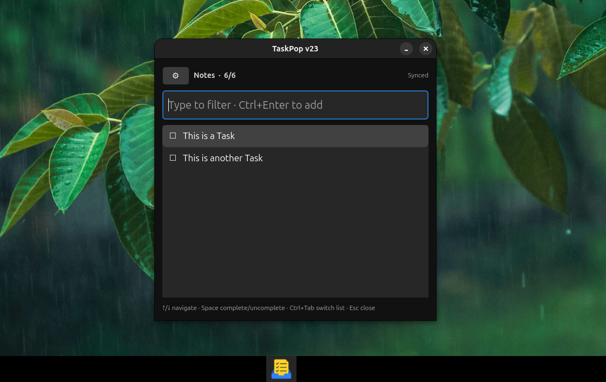

# TaskPop



TaskPop is a fast, keyboard-first Ubuntu/GNOME task popup with local SQLite task lists and optional Google Tasks sync.

See [Changelog.md](Changelog.md) for release history.

## Features

- Fast popup task manager for Ubuntu/GNOME.
- Local-first task storage using SQLite.
- Optional Google Tasks sync.
- Separate local lists and Google Tasks lists.
- In-place task details panel.
- Task notes/details.
- Smart date and time entry.
- TaskPop-local due time and reminder fields.
- Keyboard navigation for tasks, lists, and commands.
- Command mode by typing `:`.
- Custom app icon and GNOME shortcut support.

## Install on Ubuntu

```bash
cd taskpop_mvp
chmod +x install_ubuntu.sh install_shortcut_gnome.sh kill_taskpop_instances.sh debug_taskpop.sh
./install_ubuntu.sh
./install_shortcut_gnome.sh
taskpop
```

The shortcut installer binds:

```text
Super + T → TaskPop
```

## Google Tasks setup

1. Create or select a project in Google Cloud Console.
2. Enable Google Tasks API.
3. Configure OAuth consent.
4. Add your Google account as a test user.
5. Create OAuth Client ID → Desktop app.
6. Download the JSON file.
7. Save it as:

```text
~/.config/taskpop/google_client_secret.json
```

Then open TaskPop → Settings → enable Google Tasks → Sync Now.

## How it works

TaskPop keeps local lists and Google Tasks lists separate.

```text
💻 Local lists stay local.
🌐 Google Tasks lists sync with Google Tasks.
```

Both can be enabled at the same time. TaskPop does not allow both Local Lists and Google Tasks to be disabled at the same time.

## Task details

Select a task and press:

```text
Ctrl + D
```

This opens the task details panel with:

- Task name
- Task details / notes
- Date & time
- Reminder options

Save with:

```text
Ctrl + S
```

Cancel with:

```text
Esc
```

## Smart date and time input

TaskPop accepts flexible date/time formats.

Examples:

```text
23/08 6am
13jan 1600
tomorrw at 6pm
jan11 4pm
18:30
0830
6pm
```

Supported date styles include:

```text
DD-MM-YYYY
DD/MM/YYYY
DD MM YYYY
DD-MM
DD/MM
DD MM
DD-MMM
DD MMM
13jan
jan13
```

Separator can be `/`, `-`, or a space.

If year is not entered, TaskPop uses the current year if the date is upcoming, otherwise next year.

If only time is entered, TaskPop uses today if the time is still upcoming, otherwise tomorrow.

Settings allow:

```text
Date-Month or Month-Date
24 hrs or AM/PM
```

## Google Tasks date/time note

Google Tasks sync supports task title, notes, completion status, and due date.

Google Tasks API stores only the due date and discards due time. TaskPop therefore keeps due time and reminder timing locally.

## Keyboard shortcuts

| Shortcut | Action |
|---|---|
| `Super + T` | Open/close TaskPop |
| `Ctrl + Enter` | Add task / run selected command |
| `Ctrl + D` | Open task details panel |
| `Shift + Enter` | Open task details panel |
| `Ctrl + E` | Quick edit selected task name |
| `Ctrl + L` | Rename current list |
| `Ctrl + C` | Copy selected task text |
| `Ctrl + O` | Open Settings |
| `Ctrl + S` | Save in details/settings; sync in list view |
| `Ctrl + K` | Clear completed tasks |
| `Ctrl + Tab` | Next list |
| `Ctrl + Shift + Tab` | Previous list |
| `Ctrl + 1` … `Ctrl + 9` | Jump to visible list number |
| `Ctrl + 0` | Jump to last visible list |
| `↑` / `↓` | Navigate tasks or commands |
| `Space` | Tick/untick selected task when input is empty |
| `Esc` | Close popup or cancel current action |

## Commands

Type `:` to show commands. Continue typing to filter command names and descriptions.

| Command | Action |
|---|---|
| `:list-l <name>` | Create local list |
| `:list-gt <name>` | Create Google Tasks list |
| `:unlist` | Delete current list after typing `DELETE` |
| `:rename <New List Name>` | Rename current list |
| `:reorder <number>` | Move current list to a visible position |
| `:order-az` | Order visible lists A to Z |
| `:order-za` | Order visible lists Z to A |
| `:order-lg` | Order local lists first, then Google Tasks lists |
| `:order-gl` | Order Google Tasks lists first, then local lists |
| `:clear` | Clear completed tasks from current list |
| `:settings` | Open Settings |
| `:list-c-gt` | Convert local list to Google Tasks |
| `:convert-to-google-task` | Same as `:list-c-gt` |
| `:list-c-l` | Convert Google Tasks list to local |
| `:convert-to-local` | Same as `:list-c-l` |
| `:enable-gt` | Show/enable Google Tasks lists |
| `:disable-gt` | Hide/disable Google Tasks lists |
| `:enable-l` | Show/enable local lists |
| `:disable-l` | Hide/disable local lists |
| `:shortcut <binding>` | Change global shortcut |
| `:sync` | Sync Google Tasks if connected |

## Notes

The primary Google Tasks list cannot be deleted by Google. If you try to delete or convert it to local, TaskPop shows a warning and leaves it unchanged.

## Planned for future

- Desktop reminders and notifications.
- Reminder background checker using systemd user timer.
- Due today / upcoming / overdue task views.
- Search across all lists.
- Task descriptions formatting.
- Better recurring task support.
- Import/export.
- Packaging as a `.deb`.


## Google sync conflict handling

If a synced task is deleted from Google Tasks outside TaskPop, TaskPop recreates the missing Google task on the next sync instead of getting stuck with an offline pending state.
